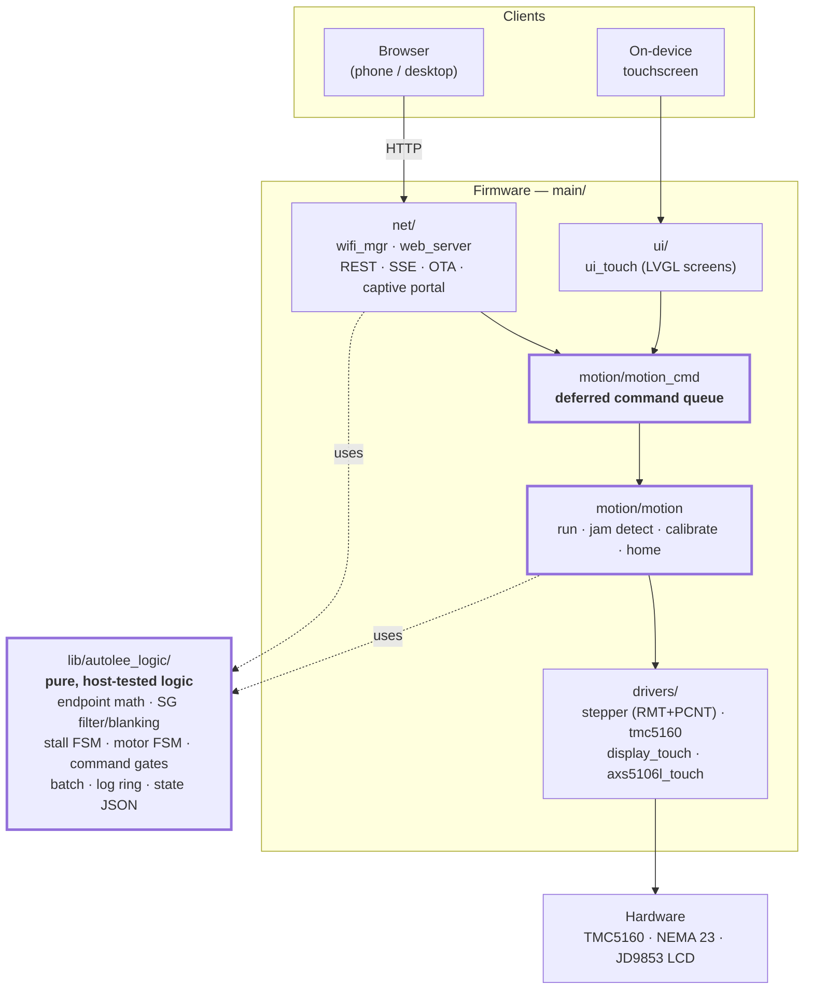
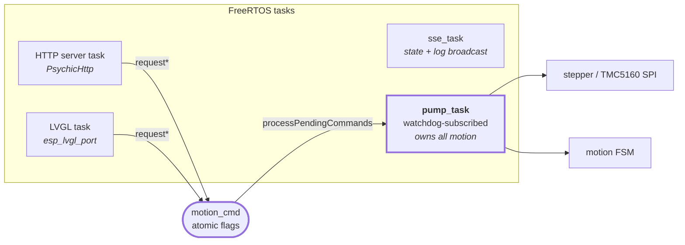
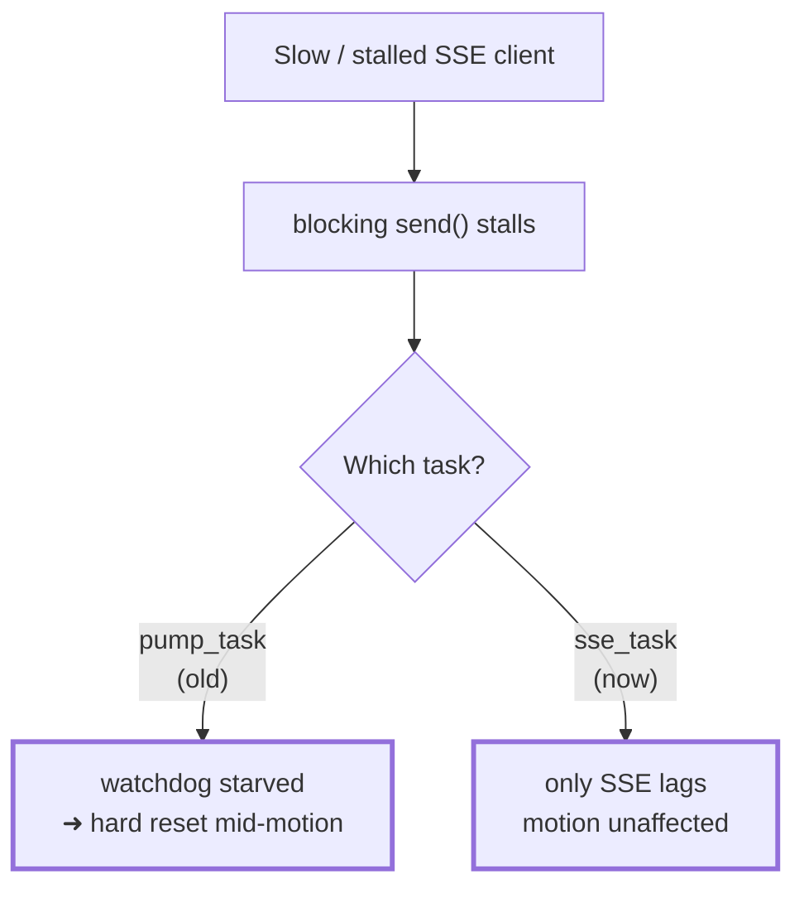
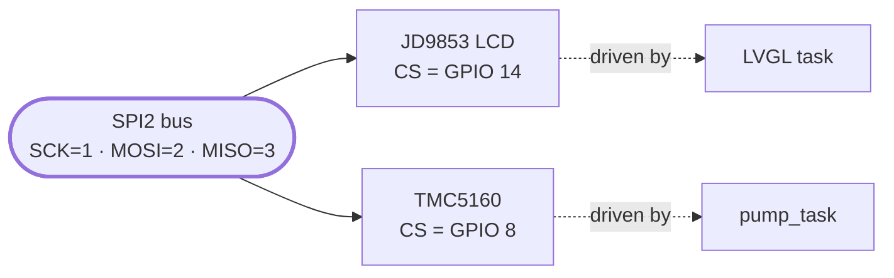
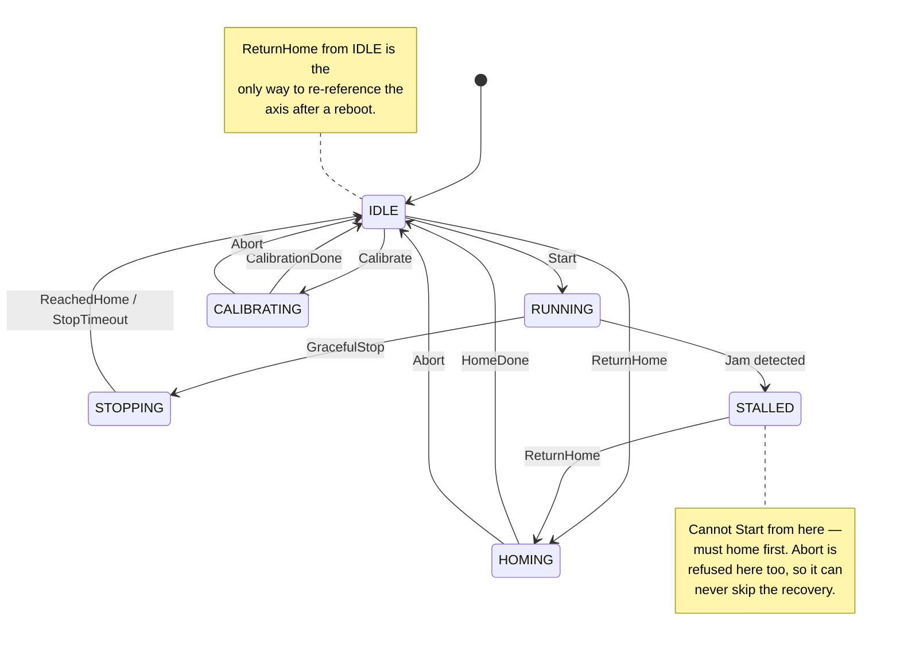

# Architecture

How the AutoLee firmware is put together: what runs where, which rules are
load-bearing for safety, and why the structure looks the way it does.

> ⚠️ This firmware drives a motorized press. The concurrency rules on this page
> are not stylistic — violating them can mean an uncontrolled reset mid-stroke or
> a corrupted jam-detection reading. See [PLAN.md](PLAN.md) for what is and isn't
> hardware-verified yet.

---

## 1. Layers

`lib/autolee_logic/` is deliberately free of ESP-IDF and Arduino dependencies, so
the **same code** that ships is what the host tests in `host_test/` exercise.

---

## 2. Tasks and the one rule that matters

The Arduino original was cooperative — everything ran from `loop()`, so a web
callback could safely call motion code directly. This port has **real
preemption**, so that is no longer true.

**The rule:** only `pump_task` touches the stepper, the TMC5160, or the motion
state machine. Everything else *requests*; nothing else acts.

### Reading motion state from another task

The mirror image of that rule: motion/endpoint/batch/profile state lives in one
struct, `g_motion` (`main/motion/motion_state.h`), behind one spinlock.

| Who | Reads | Writes |
|---|---|---|
| `pump_task` (owner) | direct, unlocked | under `motion_state::Guard` |
| HTTP task, `sse_task`, LVGL task | `motion_state::snapshot()` | under `motion_state::Guard` |

`snapshot()` copies the whole struct inside a critical section, so a reader can
never see a half-applied update — e.g. `batchCount` already incremented while
`batchActive` is not yet cleared, or a new `endpointUp` against a stale
`endpointDown`. Readers then render/serialize from their local copy, holding no
lock while they call LVGL or write to a socket. Writers group fields that belong
together into a single guard, and keep the section free of anything that logs,
blocks, allocates or touches SPI — it runs with interrupts disabled.

### Why `sse_task` is separate

`broadcastState()` does a blocking socket `send()`. It used to run inside
`pump_task`, which is watchdog-subscribed. A stalled SSE client (weak WiFi, a
backgrounded tab) could block long enough to starve the watchdog reset and force
a **hard reset mid-stroke**, bypassing every controlled-stop path in
`motion.cpp`.

So SSE now runs on its own task, and that task is deliberately **not**
watchdog-subscribed: blocking there is an expected network condition, not a bug
that should panic the device.

`sse_task` also owns the panel-recovery mitigation: it consumes the
`uiRepaintRequested` flag (set by WiFi lifecycle transitions) and runs a 30s
periodic **panel re-init** (`display_touch_panel_reinit()`). Not a repaint:
camera-on-panel measurement proved the intermittent blank-panel bug is the
JD9853 dying into a dead-until-reinit state around WiFi radio events — full
LVGL repaints ran across a dead panel for 106 measured seconds with no effect,
while a single re-run of the vendor init sequence recovered it on the exact
second it was issued. See the long comment in `app_main.cpp`'s `sse_task` for
the full evidence chain and what remains unproven (the precise analog kill
mechanism).

### Short-lived WiFi transition tasks

WiFi changes are applied **live** — joining a network, changing networks and
resetting to the setup AP never reboot the device. (Rebooting for WiFi was
inherited from the Arduino firmware and produced a whole category of field
bugs: the GPIO8/TMC_CS strapping hang, a `vTaskDelete`-inside-lwIP deadlock,
the lost first LVGL flush.) `wifi_mgr::startLiveSwitch()` and
`wifi_mgr::requestResetToSetupAp()` each spawn a short-lived task
(`wifi_switch` / `wifi_reset`, priority 3, self-deleting) that reconfigures the
running WiFi driver and then updates the LCD WiFi screen. A single in-flight
guard (`s_switching`) serializes them — callers get `false` (HTTP maps it to
409) instead of a second concurrent transition. They touch no motion state and
no SPI, so they never interact with `pump_task`'s ownership rules.

---

## 3. Shared SPI bus

The display and the TMC5160 share one bus, with software chip-select:

Two different tasks, one bus. Every TMC transfer therefore:

1. takes `spi_device_acquire_bus()` for the whole window,
2. forces the display CS **high**,
3. toggles TMC CS and transfers,
4. releases the bus.

Skipping the lock lets an LVGL flush interleave mid-transfer and corrupt a
StallGuard read — i.e. silently feed the jam detector garbage. `MISO` exists
only for these reads; the display never uses it.

---

## 4. Motion state machine

Two of those edges are easy to misread:

- **`IDLE --> HOMING`** is not redundant with the jam-recovery path. A reboot
  restores the endpoints from NVS but *not* the position reference — the
  stepper's counter comes up at 0 wherever the carriage happens to sit — so a
  creep-home from `IDLE` is the only thing that re-establishes ground truth
  against the UP hard stop. `startRunBetweenEndpoints()` refuses to run until it
  has (`MotionState::positionReferenceStale`).
- **`Abort`** exists because calibration and creep-home block `pump_task` for
  their whole duration and were otherwise uninterruptible. It is accepted from
  `CALIBRATING` and `HOMING` only — never from `RUNNING`, where a run must
  decelerate through `STOPPING`, and never from `STALLED`. See
  [FLOWS.md §2](FLOWS.md#2-cancelling-a-calibration-or-a-creep-home) for the
  unwind, which is the safety-relevant half.

The transition table is encoded in `lib/autolee_logic/motor_fsm.h` and is
host-tested exhaustively (every invalid `(state, event)` pair must be rejected).

The firmware calls it: every `runState` change in `main/motion/motion.cpp` goes
through `applyMotorEventLocked()` (`main/motion/motion.h`), a thin bridge that
runs `motorTransition()` inside the same `motion_state::Guard` as the other
fields going live with the state change — the table is a pure switch, so it is
safe in that critical section. A rejected event leaves the state untouched and
makes the entry point a logged no-op *before* it drives the TMC or the stepper.
`main/motion/motion_cmd.cpp`'s command gates ask the same table (`canStart()` /
`motionEventAllowed()`) rather than re-hardcoding which states each command is
legal from, so "cannot Start from Stalled" is enforced by the tested code, in one
place.

The table is not the whole gate, though. A `Start` is also refused when the press
was never calibrated, or when a restored calibration has left the axis
unreferenced, and a batch `Start` is refused with no target set — none of which
the FSM knows about. Those rules live in
[`lib/autolee_logic/command_gate.h`](../lib/autolee_logic/command_gate.h), as
pure functions of a `MotionState` snapshot, so the HTTP layer can consult them to
answer a caller **and** `pump_task` can re-evaluate them when it actually applies
the command. The second evaluation stays authoritative: state can change in
between, so the first is only ever the absence of an already-known refusal, never
permission. [FLOWS.md §1](FLOWS.md#1-a-control-command-end-to-end) walks the whole
path, including which failures become `400` and which become `409`.

### Jam detection

StallGuard is read over SPI (median-of-5 to reject glitches) and compared to a
per-profile trip threshold, with a sliding counter so one spike can't trigger a
stop. Monitoring is **blanked** in windows where high load is normal:

| Window | Why blanked |
|---|---|
| Acceleration | Load spikes while ramping |
| Deceleration | Same, on the way down — *unless* jam evidence is already accumulating |
| Work zone near DOWN | Primer seating is legitimately hard |

On a confirmed jam: stop → back off → `STALLED` → operator returns home.

---

## 5. Build-time layout

The directory layout is documented in
[CONTRIBUTING.md](../CONTRIBUTING.md#repository-layout).

Architecturally the one thing worth knowing: the subdirectories under `main/`
are all on `INCLUDE_DIRS`, so `#include "motion.h"` resolves from anywhere. The
grouping is navigational, not a module boundary the compiler enforces.

---

## 6. Safety mechanisms

| Mechanism | What it buys | Verified? |
|---|---|---|
| OTA rollback | An image that fails its post-boot self-check reverts automatically | ✅ on hardware |
| Task + interrupt watchdog | A hung task resets the board rather than leaving a powered stepper frozen | ✅ on hardware |
| Core dump to flash | Post-crash backtrace instead of a silent reboot | ✅ on hardware |
| Digest auth on all writes | Nobody on the network can start the press or flash firmware | ✅ on hardware |
| Brownout detection | Clean reset when the rail sags | ⚙️ needs the press's PSU under load |
| Jam detection / controlled stop | Brass jams only — **never** a guard for hands | ⚙️ needs the motor rig |
| Refusal reporting on control routes | A command the machine cannot carry out is answered `400`/`409` instead of a silent `200 ok` | ✅ on hardware (bare board) |
| Operator abort of a blocking search | A calibration or creep-home can be cancelled; the unwind leaves the axis unreferenced rather than half-calibrated | ✅ on hardware (bare board) |
| Settings-blob version migration | An upgrade carries the calibration forward, or fails safe to defaults — never a partially-trusted blob | ✅ on hardware (v2 → v3) |

"✅ on hardware (bare board)" means verified on an ESP32-C6 with **no TMC5160 and
no motor attached** — the request/response contract, the state machine and the
unwind paths are exercised, the mechanics are not. Anything that depends on the
motor actually turning is still ⚙️.

Configuration lives in `sdkconfig.defaults`; see
[adr/0001-build-tooling-and-platform.md](adr/0001-build-tooling-and-platform.md)
for why ESP-IDF was chosen and what each option concretely buys.

---

## See also

- [FLOWS.md](FLOWS.md) — sequence diagrams: how a control command, an abort and the event stream actually behave over time
- [PLAN.md](PLAN.md) — phased migration checklist and what remains unverified
- [wiring.md](wiring.md) · Bill of Materials: [24V](24V/bill-of-materials.md) · [36V](36V/bill-of-materials.md)
- [../CONTRIBUTING.md](../CONTRIBUTING.md) — build, test, and release workflow
