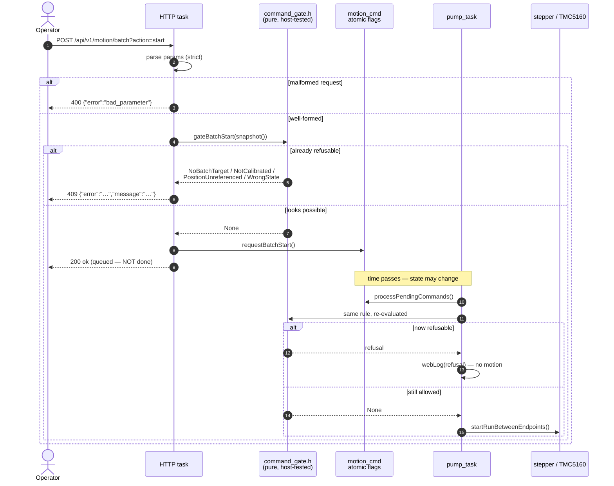
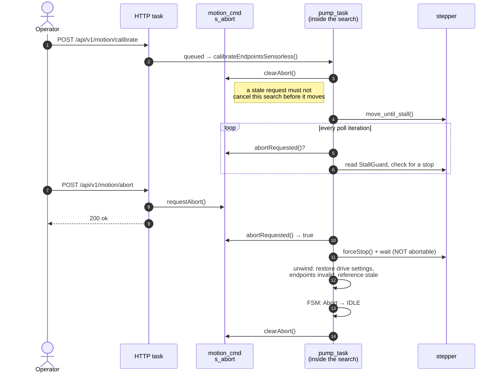
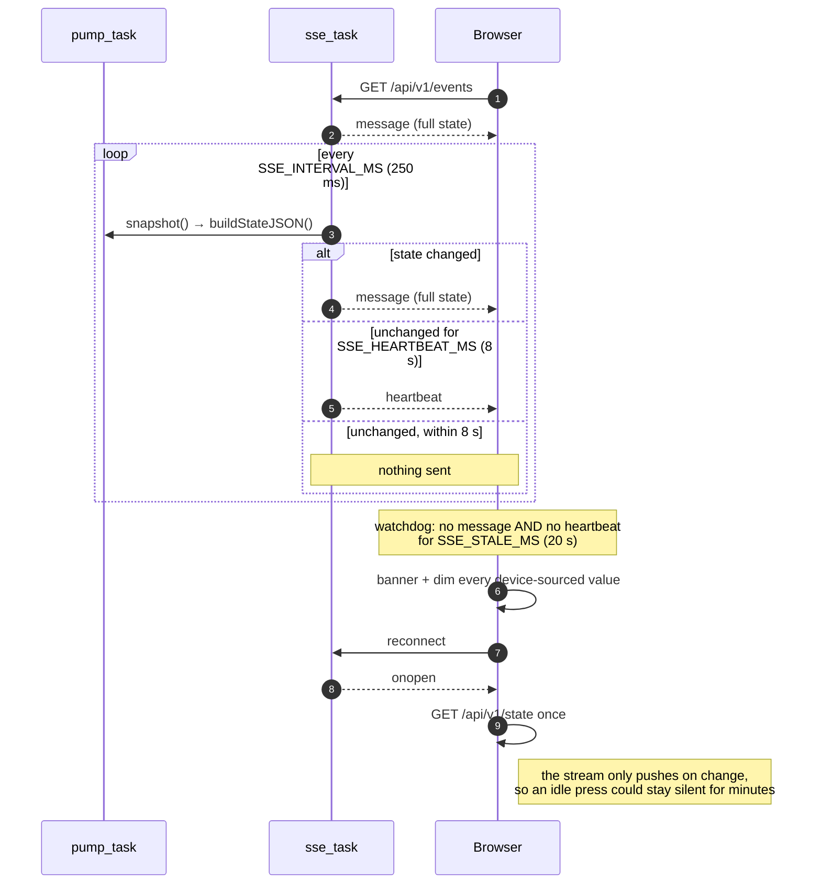

# Runtime flows

[ARCHITECTURE.md](ARCHITECTURE.md) describes what the system *is* — the layers,
the tasks, the shared bus, the state machine. This document describes what
*happens over time* when someone presses a button, and it exists because three of
those sequences are counter-intuitive enough that a reader who assumes the
obvious design will get them wrong:

- a control command is validated **twice**, and only the second one counts;
- the abort command deliberately **bypasses** the command queue every other
  command goes through;
- the event stream deliberately says nothing most of the time, so "quiet" and
  "dead" have to be told apart another way.

---

## 1. A control command, end to end

Every mutating `/api/v1/motion/*` route and every touch-UI button lands in the
same place: a `motion_cmd::request*()` call that sets a flag, and a later pass of
`processPendingCommands()` on `pump_task` that acts on it. Nothing else may touch
the stepper, the TMC5160 or the motion FSM (see
[ARCHITECTURE.md §2](ARCHITECTURE.md#2-tasks-and-the-one-rule-that-matters)).

The part worth understanding is that the request is checked **twice**, against
the same rules, and the two checks answer different questions.

**Why twice.** The HTTP check cannot be authoritative: it runs on a different
task, and the press can jam, finish a batch or be stopped from the panel between
the response and the execution. Removing the `pump_task` re-check to "avoid
duplication" would be a safety regression, not a simplification.

The HTTP check cannot be dropped either — without it the caller gets `200 ok` for
a request the machine was always going to refuse, which is exactly the bug this
design replaced. Before it, *every* motion route returned `200` unconditionally,
so a refused command and an honoured one were indistinguishable to both the
dashboard and any script.

Both evaluations call the same pure predicates in
[`lib/autolee_logic/command_gate.h`](../lib/autolee_logic/command_gate.h), so the
rule lives in one host-tested place rather than being written out twice.

`motion_cmd.cpp` keeps a single `canStart()` call, and it is deliberately not a
gate: `gateToggleRun()` has already allowed the command by that point, and the
call only asks which of the button's two meanings the tap had. It uses the same
predicate the gate used to make that decision, so the two cannot disagree.

**What a `200` means here:** *accepted into the queue, and not already
refusable.* It is not "done". Watch `GET /api/v1/state` — or the SSE stream — for
the effect, and the log for a late refusal.

| Code | Meaning | Decided by |
|---|---|---|
| `400 bad_parameter` | The request is malformed — missing, non-numeric, or outside the documented set | HTTP task, always decidable |
| `409` + reason slug | Well-formed, but impossible from the current state | `command_gate.h`, advisory |
| `403 default_password` | Factory password still in effect | auth middleware |
| `200 ok` | Queued, not already refusable | — |

Reason slugs are `wrong_state`, `not_calibrated`, `position_unreferenced` and
`no_batch_target`. They are part of the published contract
([`api/openapi.yaml`](../api/openapi.yaml)) and are pinned by
`host_test/test_command_gate`.

---

## 2. Cancelling a calibration or a creep-home

Calibration and creep-home are **not** like the commands above. They are blocking
sensorless searches: they occupy `pump_task` for their whole duration — tens of
seconds of slow, current-limited creep on the real press — and while one runs,
`processPendingCommands()` never gets a turn.

That is why abort is the one command that does **not** go through the queue. A
queued abort could not be delivered until the search it was meant to cancel had
already finished.

**The unwind is the safety-relevant part.** A calibration that did not finish
must never leave the machine looking like one that did:

- drive current, speed and acceleration are restored on every exit path;
- the endpoints stay invalid (they were cleared on entry);
- `positionReferenceStale` is latched, so a run is refused until a successful
  home or calibration re-references the axis.

Two deliberate asymmetries, both easy to get wrong:

- **The wait after `forceStop()` is not itself abortable.** That wait *is* the
  stop. Honouring an abort there would mean abandoning the wait for the axis to
  actually come to rest.
- **An abort after both hard stops were found still discards everything.**
  `rawDown` is only measured after the final backoff move, so a cancel in that
  window would otherwise store a DOWN endpoint short by an unknown amount — and
  DOWN is what decides how deep the ram travels. Conversely, the final park move
  is *not* abortable: the calibration is already stored by then, and cancelling
  would throw away a good one to save a few seconds of travel.

**Abort cannot be used as a shortcut.** The FSM
([`motor_fsm.h`](../lib/autolee_logic/motor_fsm.h)) accepts `Abort` only from
`CALIBRATING` and `HOMING` — never from `RUNNING`, where a run must decelerate
through `STOPPING`, and never from `STALLED`, where "you must home first" is the
entire reason the state exists. Cancelling a jam-recovery home lands on `IDLE`
with an unreferenced axis: a run is still refused, and Return Home is still
offered.

---

## 3. Live state to the browser

The dashboard renders almost entirely from Server-Sent Events. `broadcastState()`
sends a full state payload **only when the state actually changed**, which means
silence is the normal condition on an idle press — and silence is also what a
dead connection looks like.

**Why `onerror` is not enough.** It fires when the socket resets. A connection
that stops *delivering* without resetting — a WiFi roam, a NAT or proxy idle
timeout, the device rebooting behind a stuck TCP session — never raises it. The
page went on rendering the last state it received, indistinguishable from live,
so a press that had since jammed still read `IDLE`.

The heartbeat is what makes the distinction possible: counting both event types
as signs of life separates "nothing changed" from "nothing is arriving".

**The one coupling to keep in mind:** the client's `SSE_STALE_MS` (20 s) must
stay above twice the firmware's `SSE_HEARTBEAT_MS` (8 s, `main/config.h`), so a
single dropped heartbeat is not reported as a dropout. The two constants live in
different files with nothing enforcing the relationship — measured at 8.0 s
cadence on hardware, giving a two-heartbeat margin.

---

## See also

- [ARCHITECTURE.md](ARCHITECTURE.md) — layers, tasks, the shared SPI bus, the motion state machine
- [`api/openapi.yaml`](../api/openapi.yaml) · [`api/asyncapi.yaml`](../api/asyncapi.yaml) — the published HTTP and SSE contracts
- [`lib/autolee_logic/command_gate.h`](../lib/autolee_logic/command_gate.h) — the refusal predicates, and why they are evaluated twice
- [`main/settings_blob.h`](../main/settings_blob.h) — the persisted-settings layout and its version-migration recipe
