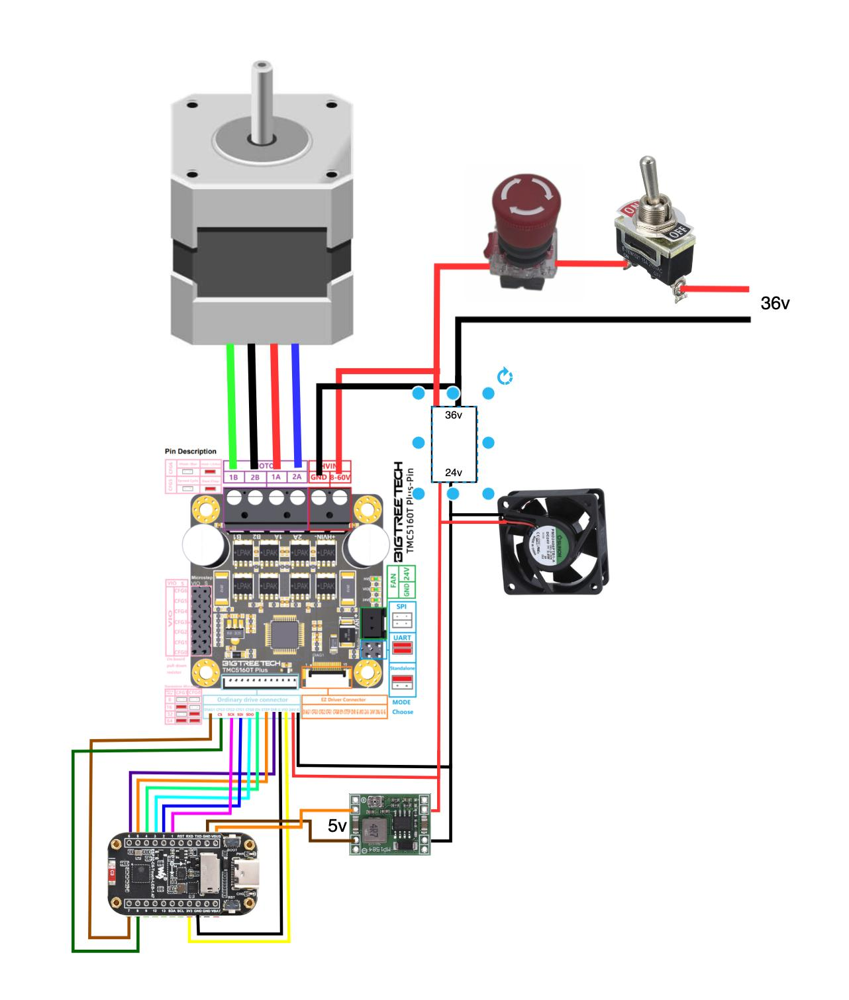

# Wiring

Two power variants exist — **24V** and **36V** — each with its own diagram and parts list:

- **24V:** [Bill of Materials](24V/bill-of-materials.md) · 
- **36V:** [Bill of Materials](36V/bill-of-materials.md) · 

The pin mapping below is identical for both variants; only the power-rail voltages differ.

### ESP32-C6 → TMC5160T Plus (SPI)

| ESP32-C6 Pin | TMC5160 Pin | Function |
|:---:|:---:|---|
| GPIO 1 | SCK | SPI Clock |
| GPIO 2 | SDI (MOSI) | SPI Data In |
| GPIO 3 | SDO (MISO) | SPI Data Out |
| GPIO 8 | CS | SPI Chip Select |
| GPIO 4 | EN | Enable (active low) |
| GPIO 5 | STEP | Step pulse |
| GPIO 6 | DIR | Direction |
| GPIO 7 | DIAG1 | StallGuard diagnostic output |

### Power

Substitute the variant's actual rail voltage (24V or 36V — see the BOM links above) wherever
"PSU" appears below; the buck converter always steps down to 5V logic power regardless of
variant.

The On/Off switch (#8) and the Emergency Stop (#10) are both in series on the
positive rail, upstream of every load — see the wiring diagrams above for the
full picture, including the fan supply, which differs between the variants.

| Connection | Details |
|---|---|
| PSU → On/Off switch → E-stop | Both in series on the positive rail, upstream of every load |
| E-stop → TMC5160 VM (HVIN) | Motor power |
| E-stop → Buck converter IN | Feeds the buck converter |
| Buck converter OUT (5 V) → ESP32-C6 | Logic power |
| PSU → Fan | See the variant wiring diagram — the fan supply is not the raw rail on every build |
| GND | Common ground between all boards |

> **The Emergency Stop (#10) is normally-closed and cuts the whole rail — including
> logic power.** Pressing it does not merely stop the motor: the ESP32-C6 loses its
> 5 V supply along with the TMC5160, so the controller powers down mid-stroke. This
> is the machine's *only* people-safety device; see the
> [safety warning](../README.md#-safety-warning--read-before-building-or-operating).
>
> Because the controller reboots, the firmware comes back with the stepper's position
> counter at 0 while the carriage sits wherever it stopped. The stored calibration is
> restored but flagged unreferenced, and a run is refused until a **Return Home**
> re-establishes the reference against the UP hard stop. That is expected behaviour
> after every E-stop, not a fault.

> **Important:** The display and TMC5160 share the SPI bus (GPIO 1, 2). The firmware manages chip-select lines (GPIO 8 for TMC, GPIO 14 for display) to avoid bus conflicts. The display CS is forced high before every StallGuard SPI read.

---
