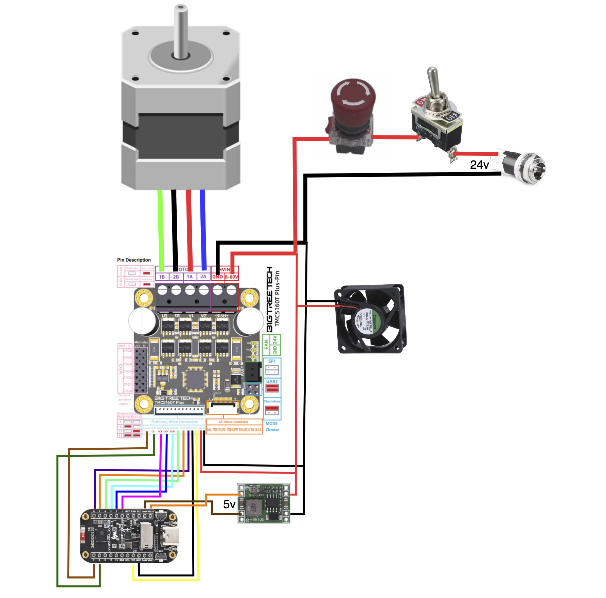

# Wiring

Parts list: [Bill of Materials](bill-of-materials.md).

### ESP32-C6 → TMC5160T Plus (SPI)

| ESP32-C6 Pin | TMC5160 Pin | Function |
|:---:|:---:|---|
| GPIO 1 | SCK | SPI Clock |
| GPIO 2 | SDI (MOSI) | SPI Data In |
| GPIO 3 | SDO (MISO) | SPI Data Out |
| GPIO 8 | CS | SPI Chip Select |
| GPIO 4 | EN | Enable (active low) |
| GPIO 5 | STEP | Step pulse |
| GPIO 6 | DIR | Direction |
| GPIO 7 | DIAG1 | StallGuard diagnostic output |

### Power

| Connection | Details |
|---|---|
| 24 V PSU → TMC5160 VM | Motor power (24 V) |
| 24 V PSU → Buck converter IN | Feeds the buck converter |
| Buck converter OUT (5 V) → ESP32-C6 | Logic power |
| 24 V PSU → Fan | Direct 24 V to cooling fan |
| GND | Common ground between all boards |

> **Important:** The display and TMC5160 share the SPI bus (GPIO 1, 2). The firmware manages chip-select lines (GPIO 8 for TMC, GPIO 14 for display) to avoid bus conflicts. The display CS is forced high before every StallGuard SPI read.

---
